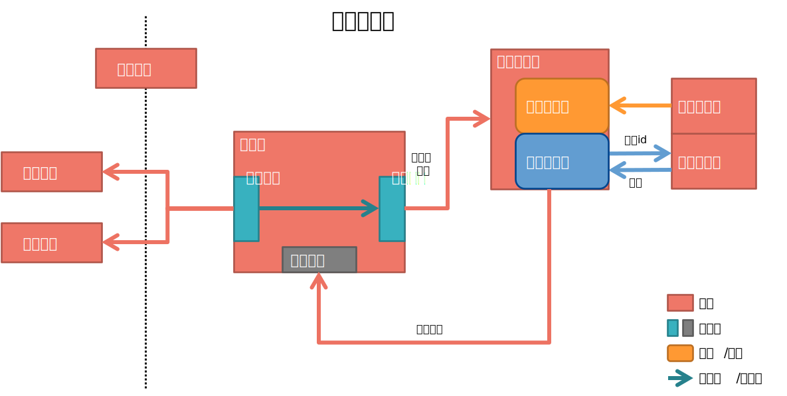
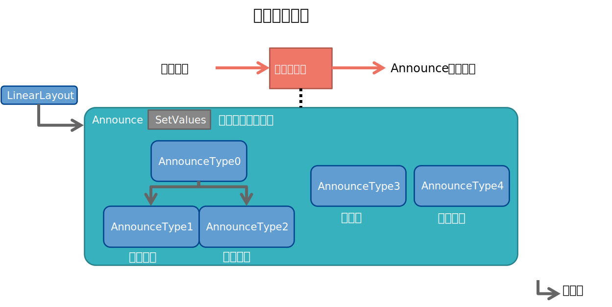

# 今日面包

字节训练营-玩转客户端大作业：新闻类安卓APP

作者：麦济仁，王珏

|成员|负责部分|
|--|--|
|麦济仁|欢迎界面、主界面及其架构和组件（附加功能和基础部分）|
|王珏|登陆界面、文章界面及其架构和组件（进阶一、二、三）|

------

1. [程序框架](#程序框架)
2. [公告项工厂](#公告项工厂)
3. [运行展示](#运行展示)

## 程序架构

架构图中每个红框表示一个模块，主界面模块内部有三个事件槽：屏幕事件、拉取触发和组件追加。其中屏幕事件响应诸如滑动、点击之类的事件，主界面有个内部触发，比如说手指滑动，内容滚动到靠近屏幕底部的时候，会触发一个内容拉取事件。内容拉取会将一个预设的数据批次大小值传给数据批发器，数据批发器在准备好足够数据之后，触发一个回调，将批量数据追加到主界面的内容页中。

这里的数据批发器是我们设计的一个相对巧妙的模块，它内部包含两个对象，或者说两个依赖，数据迭代器和数据包装器。我们通过依赖注入来定义数据批发器的具体行为。比如说，数据批发器需要迭代器迭代来获取数据，在这个项目中，我们注入一个本地数据源，其实就是读取本地的json文件获得json数组，数组本身是可迭代的，注入到批发器里面，它就会不断获取json文件中定义的公告信息；而数据包装器的职责，是对迭代数据进行一个后处理，因为我们通常迭代到的都是比较粗的、原始的数据，比如说json中读到的都是些文本信息对吧，这样我们就需要进行一些特定的包装，使得从这里批发出去的数据是处理好的、能够直接使用的，等于说这里是一种委托，委托处理。在这个项目中，我们读取json中定义的公告类型，向这个工厂中申请构建一个实例，这个工厂在[公告项工厂](#公告项工厂)中详细介绍，生成的实例是一种具体的Layout，然后包装器再进行一些布局设置、属性设置。在准备好之后，将数据批发出去，调用回调将数据追加到主界面内容页中去。通过设计这样的模块呢，我们可以将UI和数据加载行为做一个分离，而依赖注入的设计模式，使得这个行为可以很轻松地被定义，举例说，如果后续需要从网络拉取公告项的话，我们可以将这个本地数据源换成一个网络数据源，其实只需要封装一下迭代方式就可以了；而公告项工厂使用反射实现，也可以很方便地增加新的公告类型。此外，这个架构图只介绍了每个模块对外暴露的接口，而内部实现是未定义的，实际上数据批发器我们设置了一个缓冲队列，在构造之初开启副线程并行地准备数据，可以大幅提升运行效率。这也是低耦合带来的好处，只去优化实现，而不是接口。

再说回屏幕事件，除了内容拉取，还有点击公告的时候会跳转到文章详情页，这里约定了一组简单的接口，点击事件以及附加的信息会通过这个接口发送出去，到左边两个界面中具体处理。除此之外，我这里还有一个用户信息模块，这个模块对外的读写特性对于所有模块都是平等的，登陆界面会将一些登录后获取的信息写到用户信息模块，主界面也会从用户信息模块读取一些用户信息，用来显示头像之类的。后续如果有扩展需要的话，还有一些个人主页也会在这个框架下实现。

## 公告项工厂

公告项工厂，通过给工厂一个类型id，工厂去寻找已经实现的具体类，并创新类的实例返回。所有类型的公告，都继承自Announce抽象类，这个类是LinearLayout的子类，要求实现SetValues方法，来设置自身的属性，比较基础的有标题、作者、时间这些属性，而子类继承之后可以再拓展其他属性，并重写设置属性的行为。比如类型1、2的单缩略图，类型4的多缩略图等等。具体类会再去自己定义详细的布局方式。

## 运行展示

总展示

文章阅读展示

